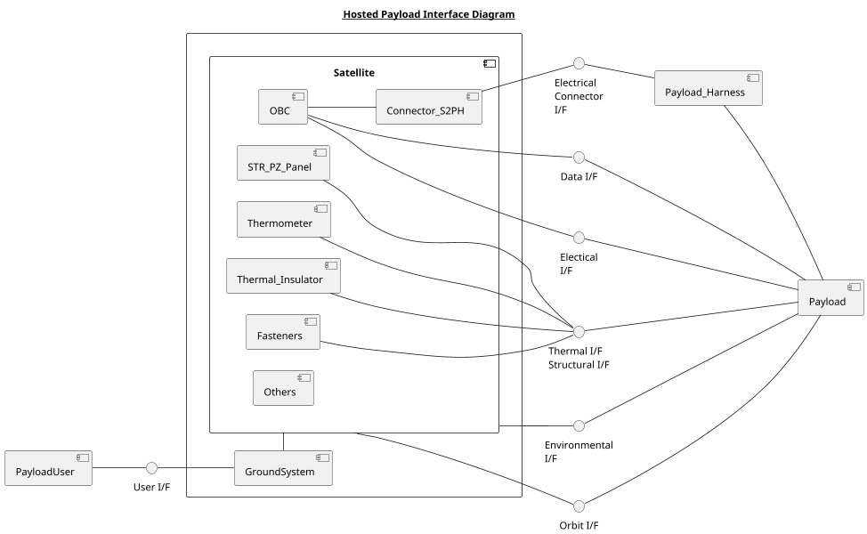

## Component and interface diagram
The hosted payload interface diagram below represents what is explained in this document by showing several types of interface between the hosted payload and the satellite. Each of the interface symbol corresponds to a section of this document. Also it shows some of the satellite components that are mentioned in this document.




```plantuml
title
__Ground System Interface Diagram__
end title

autonumber 0

participant PayloadUser
participant GroundSystem
participant Satellite
participant Payload

Satellite <-- Payload : Telemetry
...
PayloadUser --> GroundSystem : Request
activate GroundSystem
rnote over GroundSystem: Create command
Satellite <-- GroundSystem : Uplink
deactivate GroundSystem
...
Satellite --> Satellite : Time-tagged command
activate Satellite
Satellite --> Satellite : Command to satellite bus
deactivate Satellite
...
Satellite --> Satellite : Time-tagged command
activate Satellite
Satellite --> Payload : Command
deactivate Satellite
...
Satellite <-- Payload : Telemetry
activate Satellite
Satellite --> Satellite : Store the telemetry data
deactivate Satellite
...
Satellite --> Satellite : Read from storage
activate Satellite
Satellite --> GroundSystem : Downlink
deactivate Satellite
rnote over GroundSystem: Create raw data set
activate GroundSystem
GroundSystem --> PayloadUser : Data product
deactivate GroundSystem
```


### Responsibility assignment (**Payload specific**)

Responsibility of participating organization for each component is listed below.

```vega-lite
{
  "$schema": "https://vega.github.io/schema/vega-lite/v4.json",
  "width": 400,
  "data": {"values":[
    {
      "Item":"Payload",
      "Organization": "ASPINA",
      "Symbol": "O"
    }, {
      "Item":"Payload harness",
      "Organization":"ASPINA",
      "Symbol": "O"
    }, {
      "Item":"Satellite",
      "Organization":"Axel",
      "Symbol": "O"
    }, {
      "Item":"GroundSystem",
      "Organization":"Axel",
      "Symbol": "O"
    }, {
      "Item":"PayloadUser",
      "Organization": "ASPINA",
      "Symbol": "O"
    }
    ]
  },
  "layer":[{
    "mark": {"type": "text", "filled": false}
  },{
    "mark": {"type": "rect", "opacity": 0}
  }],
  "encoding": {
    "y": {"field": "Item", "type": "nominal",
    "sort": "null",    
    "axis": { "tickBand": "extent"}
    },
    "x": {
      "field": "Organization", "type": "ordinal",
      "sort": "null",    
      "axis": { 
        "tickBand": "extent",
        "orient": "top",
        "labelAngle": 0
      }
    },
    "text": {"field": "Symbol"}
  },
  "config": {
    "axis": {"grid": true, "tickBand": "extent"}
  }
}
```
